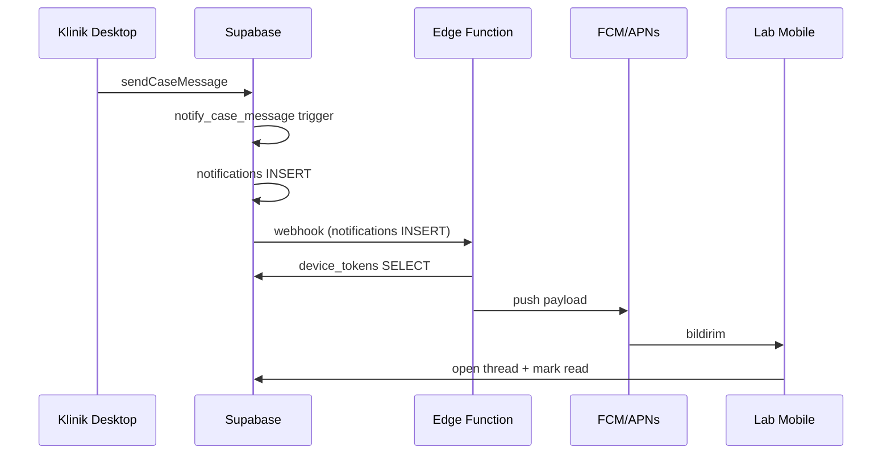

# MeshPack Lab Mobile — Mimari

> **Son güncelleme:** 2026-07-08  
> **Durum:** Planlama — henüz kod yok  
> **Karar:** Klinik + Lab **desktop** devam eder; Lab için **kısıtlı mobil companion** (mesaj + bildirim + hafif önizleme).

---

## Ürün modeli (üç uygulama)

```
┌─────────────────────┐     ┌─────────────────────┐     ┌─────────────────────┐
│  MeshPack Clinic    │     │  MeshPack Lab       │     │  MeshPack Lab       │
│  (Desktop / Tauri)  │     │  (Desktop / Tauri)  │     │  (Mobile)           │
├─────────────────────┤     ├─────────────────────┤     ├─────────────────────┤
│ Tarama izleme       │     │ Vaka kuyruğu        │     │ Konuşma listesi     │
│ Planlama + 3D       │     │ ZIP indirme         │     │ Sohbet              │
│ Alignment + export  │     │ 3D önizleme         │     │ Push bildirim       │
│ Cloud'a gönderim    │     │ Durum güncelleme    │     │ Vaka özeti kartı    │
│ Küçük mesaj paneli  │     │ Mesajlar sekmesi    │     │ (ops.) thumbnail    │
└──────────┬──────────┘     └──────────┬──────────┘     └──────────┬──────────┘
           │                           │                           │
           └───────────────────────────┴───────────────────────────┘
                                       │
                              ┌────────▼────────┐
                              │  Supabase Cloud │
                              │  (ortak backend)│
                              └─────────────────┘
```

**Prensip:** Mobil = “haberdar ol ve hızlı cevap ver”. Asıl iş (dosya, 3D, üretim) desktop’ta.

---

## Kapsam

### Mobilde VAR

| Özellik | Açıklama |
|---------|----------|
| Giriş / oturum | Supabase Auth (email+şifre); lab org üyeliği zorunlu |
| Konuşma listesi | `list_message_threads` RPC — sayfalı, unread badge |
| Sohbet | Mesaj gönder/al, realtime, sayfalı geçmiş |
| Push bildirim | Yeni mesaj → FCM (Android) / APNs (iOS) |
| Vaka özeti kartı | Vaka no, hasta adı, durum, gönderim zamanı |
| Metadata önizleme | `manifest` / `dental_plan` özetinden “ne gelmiş” (metin) |
| Deep link | Bildirimden ilgili konuşmaya git |

### Mobilde YOK (bilinçli sınır)

| Özellik | Neden |
|---------|-------|
| ZIP indirme | Büyük dosya, mobil depolama, güvenlik |
| Storage erişimi | `case-packages` bucket — mobil policy ile kapalı |
| 3D mesh viewer | Performans + kapsam; desktop’ta kalır |
| Durum güncelleme | v1’de yok; istenirse v2 |
| Klinik bağlantı yönetimi | Desktop admin işi |
| Offline mesaj kuyruğu | v2 (Expo offline queue) |

---

## Teknik mimari

### Stack önerisi

| Katman | Seçim | Gerekçe |
|--------|-------|---------|
| Framework | **Expo (React Native)** | Mevcut JS/Supabase modülleri yeniden kullanılabilir; push + deep link hazır |
| Auth / API | **@supabase/supabase-js** | Klinik/lab ile aynı client |
| Realtime | Supabase Realtime | `case_messages`, `notifications` (zaten publication’da) |
| Push | Expo Notifications + Supabase Edge Function | FCM/APNs token kaydı |
| Navigasyon | Expo Router | Tab (konuşmalar) + stack (sohbet, vaka kartı) |
| State | Hafif (React context veya Zustand) | Hub UI ile aynı pattern |

Alternatif: Flutter — daha tutarlı UI ama `meshpack-lab/src/cloud/*` yeniden yazılır.

### Repo yapısı (öneri)

```
meshpack/
├── meshpack-lab/          # Lab desktop (mevcut)
├── meshpack-lab-mobile/   # Yeni — Expo app
│   ├── app/               # Expo Router ekranları
│   ├── src/
│   │   ├── cloud/         # auth, messages, notifications, messagingHub (lab'dan uyarlanır)
│   │   ├── hooks/         # useThreads, useChat, usePush
│   │   └── components/    # ThreadList, ChatBubble, CaseSummaryCard
│   ├── app.json
│   └── package.json
├── supabase/
│   └── functions/
│       └── push-notification/   # Edge Function (yeni)
└── docs/LAB_MOBILE.md     # Bu dosya
```

Paylaşılan kod: `meshpack-lab/src/cloud/{auth,messages,notifications,messagingHub}.js` — RN’de minimal değişiklikle taşınır (secure storage farklı olabilir).

---

## Veri akışları

### 1. Konuşma listesi (mevcut — hazır)

```
Mobile App
  → supabase.rpc('list_message_threads', { p_limit, p_offset })
  ← case_id, case_number, patient, status, last_message, unread_count
```

Kaynak: `supabase/migrations/20260707223000_message_threads_rpc.sql`

### 2. Sohbet (mevcut — hazır)

```
Mobile App
  → listCaseMessages(caseId, { limit, before })   # sayfalı
  → sendCaseMessage(caseId, body)
  → subscribeCaseMessages(caseId, onMessage)        # Realtime INSERT
```

Kaynak: `meshpack-lab/src/cloud/messages.js`

### 3. Bildirimler — in-app (mevcut)

```
Mobile App
  → subscribeNotifications(onChange)     # Realtime INSERT/UPDATE
  → countUnreadNotifications()         # header badge (senkron)
  → markNotificationsReadForCase(caseId)
```

Kaynak: `meshpack-lab/src/cloud/notifications.js` + `messagesHubUI.js` local-first pattern.

### 4. Push bildirim (yeni — yapılacak)

```
case_messages INSERT
  → notify_case_message() trigger (mevcut)
  → notifications INSERT (mevcut)
  → [YENİ] Database Webhook veya Edge Function
  → device_tokens tablosundan FCM/APNs token al
  → FCM / APNs gönder
  → Mobile: Expo push handler → deep link → ChatScreen
```



### 5. Vaka özeti / metadata önizleme (mevcut tablo, yeni UI)

```
Mobile App
  → cloud_cases SELECT (id, case_number, patient_display_name, status, sent_at, manifest, dental_plan)
  ← JSON özet render (dosya listesi, diş planı özeti — metin kartı)
```

**v2 (opsiyonel):** Desktop veya Edge Function ZIP işlerken `preview_thumb_url` (PNG) yazar; mobil sadece image gösterir. Tam STL viewer gerekmez.

---

## Güvenlik ve RLS

### Mevcut (değişiklik gerekmez)

- `user_org_ids()` — kullanıcı yalnızca kendi org vakalarını görür
- `list_message_threads` — SECURITY DEFINER + org filtresi
- `messages_select` / `messages_insert` — `user_can_access_case`
- `notifications_select` — `user_id = auth.uid()`

### Mobil için eklenecek

| Madde | Açıklama |
|-------|----------|
| `device_tokens` tablosu | `user_id`, `platform`, `token`, `updated_at` |
| Storage policy | Mobil client’a `case-packages` SELECT **verilmez** (veya ayrı role) |
| `cloud_cases` SELECT | Manifest/dental_plan okumaya izin — dosya path’i mobilde kullanılmaz |

```sql
-- Örnek (migration'da detaylandırılacak)
CREATE TABLE device_tokens (
  id UUID PRIMARY KEY DEFAULT gen_random_uuid(),
  user_id UUID NOT NULL REFERENCES auth.users(id) ON DELETE CASCADE,
  platform TEXT NOT NULL CHECK (platform IN ('ios', 'android')),
  token TEXT NOT NULL,
  updated_at TIMESTAMPTZ NOT NULL DEFAULT now(),
  UNIQUE (user_id, platform, token)
);
```

---

## Ekranlar (MVP)

| # | Ekran | Route | API |
|---|-------|-------|-----|
| 1 | Giriş | `/login` | `signIn`, `getActiveOrganization` |
| 2 | Konuşmalar | `/(tabs)/messages` | `list_message_threads` |
| 3 | Sohbet | `/chat/[caseId]` | `listCaseMessages`, `sendCaseMessage`, realtime |
| 4 | Vaka özeti | `/case/[caseId]` | `cloud_cases` select (metadata) |
| 5 | Ayarlar | `/(tabs)/settings` | Çıkış, bildirim izni, org adı |

**Tab bar:** Mesajlar | Ayarlar (minimal)

---

## Desktop ile ilişki

| Senaryo | Desktop | Mobile |
|---------|---------|--------|
| Yeni vaka geldi | Kuyrukta görür, ZIP indirir | Push + “yeni vaka” özeti (metin) |
| Klinik mesaj yazdı | Mesajlar sekmesi + sidebar | Push + anında sohbet |
| Lab cevap verdi | Desktop’tan yazar | Mobilden yazar — klinik her iki kanaldan görür |
| 3D önizleme | Tam viewer | Yok — “Detay için masaüstü uygulamasını açın” |
| Durum: üretimde | Desktop’tan günceller | v1’de yok |

Aynı Supabase oturumu iki cihazda paralel çalışabilir; Realtime her ikisini de günceller.

---

## Uygulama fazları

### Faz M1 — İskelet (1–2 hafta)

- [ ] `meshpack-lab-mobile/` Expo projesi
- [ ] `src/cloud/*` modüllerini taşı/uyarla
- [ ] Giriş + org kontrolü (lab org_type zorunlu)
- [ ] Konuşma listesi + sohbet (desktop hub UI ile parity)
- [ ] Realtime mesaj + local-first unread (mevcut pattern)

### Faz M2 — Push (1 hafta)

- [ ] `device_tokens` migration + RLS
- [ ] Expo push token kaydı (giriş sonrası)
- [ ] Edge Function: `notifications` INSERT → FCM/APNs
- [ ] Deep link: bildirim → `/chat/[caseId]`

### Faz M3 — Vaka özeti (3–5 gün)

- [ ] Vaka kartı ekranı (metadata)
- [ ] Manifest’ten dosya listesi (upper/lower/bite isimleri)
- [ ] Dental plan özet satırları

### Faz M4 — Polish (opsiyonel)

- [ ] Thumbnail önizleme (sunucu tarafı PNG üretimi)
- [ ] Offline mesaj kuyruğu
- [ ] iOS TestFlight / Android internal test

---

## Yeniden kullanılabilir kod (mevcut)

| Modül | Kaynak | Mobil uyumu |
|-------|--------|-------------|
| Auth + cache | `meshpack-lab/src/cloud/auth.js` | ✅ Doğrudan |
| Mesajlar + sayfalama | `meshpack-lab/src/cloud/messages.js` | ✅ Doğrudan |
| Bildirimler | `meshpack-lab/src/cloud/notifications.js` | ✅ Doğrudan |
| Thread listesi RPC | `meshpack-lab/src/cloud/messagingHub.js` | ✅ Doğrudan |
| Hub UI mantığı | `meshpack-lab/src/ui/messagesHubUI.js` | ⚠️ React Native’e port |
| Supabase client | `meshpack-lab/src/cloud/supabaseClient.js` | ⚠️ AsyncStorage session |

**Tahmini yeniden kullanım:** cloud katmanı ~%80, UI ~%0 (RN component’leri sıfırdan).

---

## Riskler

| Risk | Azaltma |
|------|---------|
| Push güvenilirliği (FCM/APNs) | Edge Function retry + Expo push receipt |
| Çok bildirim (her mesaj = 1 row) | Mevcut trigger; ileride digest (v2) |
| Kullanıcı dosya bekler mobilde | UI’da net “dosyalar masaüstünde” metni |
| KVKK / cihaz kaybı | PIN/biyometri (Expo LocalAuthentication) — v2 |
| iOS review (medical adjacent) | “Lab communication tool” positioning |

---

## Kararlar (onaylandı)

| Konu | Karar |
|------|--------|
| Klinik | Desktop devam |
| Lab iş istasyonu | Desktop devam |
| Lab mobil | Sadece mesaj + bildirim + metadata önizleme |
| Dosya erişimi mobilde | Yok |
| Backend | Mevcut Supabase — yeni servis yok |
| Web’e tam geçiş | Hayır |

---

## İlgili dosyalar

| Konu | Dosya |
|------|--------|
| Thread RPC | `supabase/migrations/20260707223000_message_threads_rpc.sql` |
| Bildirim trigger | `supabase/migrations/20260706100000_meshpack_cloud.sql` |
| Lab hub UI (referans) | `meshpack-lab/src/ui/messagesHubUI.js` |
| Yol haritası | `todo.md` → Faz 6 |
| Oturum özeti | `HANDOFF.md` |
